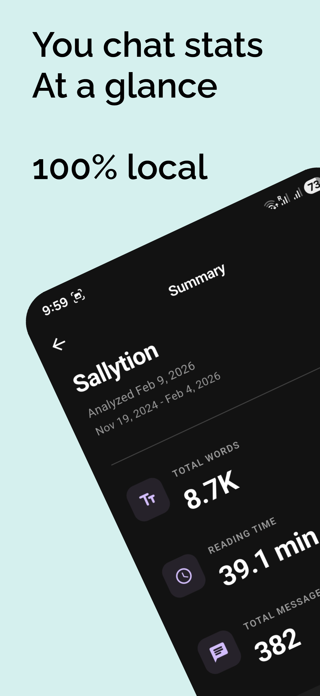
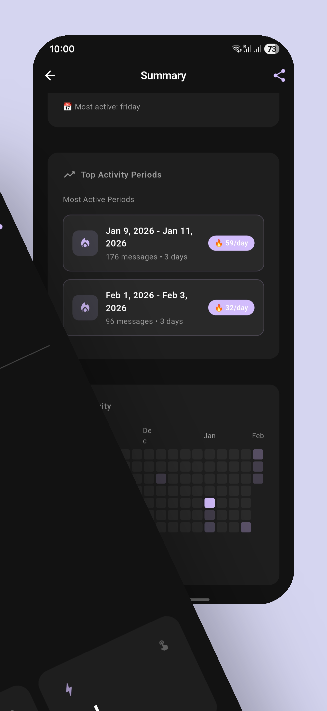
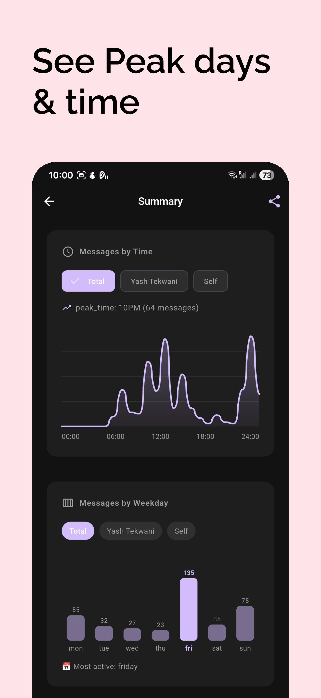
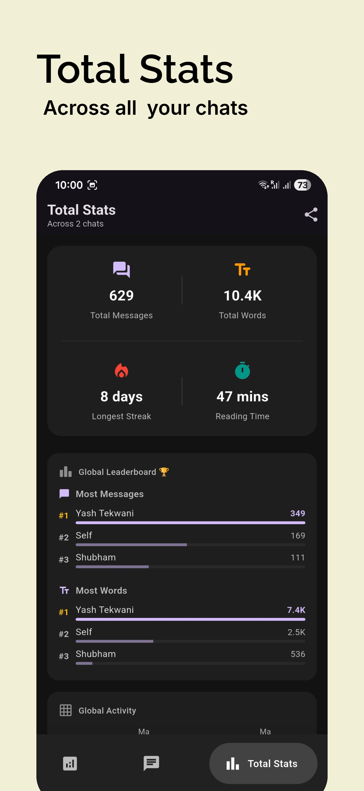
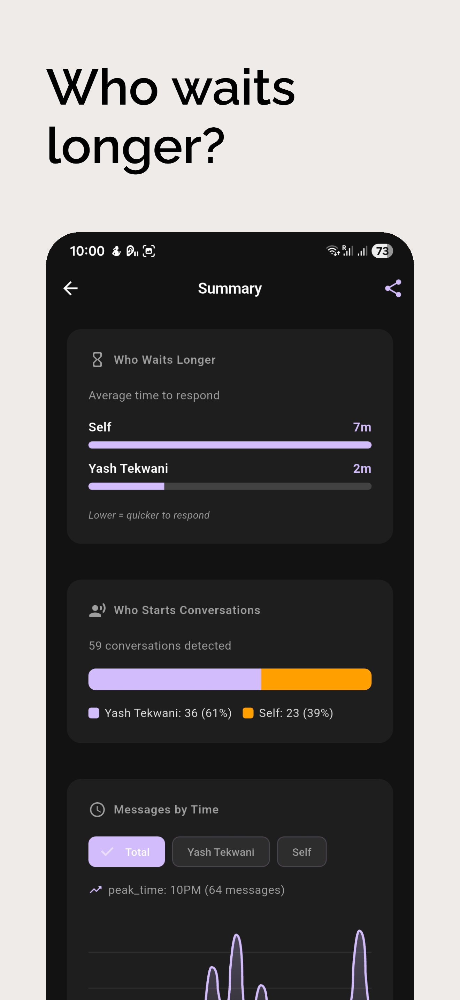

# OpenStaty 📊

> **Your chats become meaningful insights.**

OpenStaty is a privacy-first, offline analytics tool designed to visualize your WhatsApp communication patterns. Analyze your chat history directly on your device without your data ever leaving your phone.


## ✨ Features

### 🔒 Privacy First
- **100% Offline Processing**: All analysis happens locally on your device. No data is uploaded to any server.
- **Secure Storage**: Chat history is processed in memory and only summary statistics are saved locally if you choose.

### 📈 Deep Insights
- **Message Statistics**: Total messages, word count, and character count breakdown.
- **Activity Heatmaps**: Visualize your most active times of day and days of the week.
- **Conversation Dynamics**: Analyze response times, longest streaks, and conversation gaps.
- **Emoji Analysis**: discover your most frequently used emojis.
- **Top Words**: Word clouds and frequency lists to see what you talk about most. (Stop-word filtering included).

### 🎨 Beautiful Visualizations
- Interactive charts and graphs.
- **Word Clouds**: Aesthetic representation of your vocabulary.
- **Calendar Heatmaps**: GitHub-style contribution graphs for daily activity.

### 🛠️ Advanced Features
- **Multi-Format Support**: Import `.txt` exports or `.zip` archives directly from WhatsApp.
- **Direct Integration**: "Open in WhatsApp" feature to quickly export specific chats.
- **Group Chat Support**: specialized metrics for group conversations (active members, etc.).
- **Theming**: comprehensive Dark Mode and custom app themes.

---

## 📸 Screenshots

<p align="center">
  
  
  
  
  
</p>

---

## 🚀 Getting Started

### Prerequisites
- [Flutter SDK](https://flutter.dev/docs/get-started/install) (3.10.x or higher)
- Android Studio / VS Code with Flutter extensions.

### Installation

1. **Clone the repository**
   ```bash
   git clone https://github.com/Sallytion/Open-Staty.git
   cd Open-Staty
   ```

2. **Install dependencies**
   ```bash
   flutter pub get
   ```

3. **Run the app**
   ```bash
   flutter run
   ```

---

## 📱 How to Use

1. **Export a Chat from WhatsApp**:
   - Open WhatsApp -> Open a chat -> Tap three dots -> More -> Export Chat.
   - Choose "Without Media" (recommended for speed).
2. **Import into OpenStaty**:
   - **Method A (Direct Share)**: In the share sheet, select **OpenStaty**. The app will launch and instantly analyze the file.
   - **Method B (File Picker)**: Open OpenStaty, tap "Import Chat", and select the exported `.txt` or `.zip` file from your device storage.
3. **Explore Insights**:
   - View the detailed dashboard.
   - Save the analysis to your history for later viewing.

---

## 🛠️ Technological Stack

- **Framework**: [Flutter](https://flutter.dev/) (Dart)
- **State Management**: `setState` & `ValueNotifier` for localized updates.
- **UI Components**: `GoogleNavBar`, Custom Painters for charts.
- **Core Packages**:
  - `file_picker`: File selection.
  - `archive`: Handling ZIP exports.
  - `path_provider`: Local storage access.
  - `shared_preferences`: Persisting settings and history.
  - `intl`: Date formatting and localization.
  - `flutter_launcher_icons`: Adaptive icon generation.

---

## 📂 Project Structure

```
lib/
├── l10n/                # Localization files (arb)
├── models/              # Data models (ChatAnalytics, Message, etc.)
├── pages/               # Application screens (Import, Stats, Settings)
├── services/            # Logic for parsing, analyzing, and storage
├── widgets/             # Reusable UI components
│   ├── summary/         # Stats-specific widgets (Charts, WordCloud)
│   └── ...
└── main.dart            # Entry point & App Configuration
```

---

## 🤝 Contributing

Contributions are welcome! If you have ideas for new metrics or visualizations:

1. Fork the Project.
2. Create your Feature Branch (`git checkout -b feature/AmazingFeature`).
3. Commit your Changes (`git commit -m 'Add some AmazingFeature'`).
4. Push to the Branch (`git push origin feature/AmazingFeature`).
5. Open a Pull Request.

---

## 📄 License

Distributed under the MIT License. See `LICENSE` for more information.

---

## 📬 Contact

Project Link: [https://github.com/Sallytion/Open-Staty](https://github.com/sallytion/Open-Staty)
